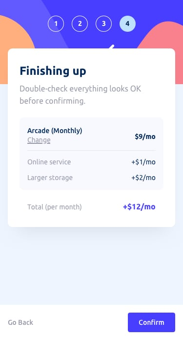

# Frontend Mentor - Solução de formulário em várias etapas

Esta é uma solução para o [desafio de formulário em várias etapas no Frontend Mentor](https://www.frontendmentor.io/challenges/multistep-form-YVAnSdqQBJ). Os desafios do Frontend Mentor ajudam você a melhorar suas habilidades de codificação criando projetos realistas.

## Índice

  - [O desafio](#O-desafio)
  - [Links](#Links)
  - [Construído com](#construído-com)
- [Autor](#Autor)
- [Agradecimentos](#Agradecimentos)

   
   
   
   

   
   
   
   

### O desafio

Os usuários devem ser capazes de:

- Complete cada etapa da sequência
- Volte para uma etapa anterior para atualizar suas seleções
- Veja um resumo de suas seleções na etapa final e confirme seu pedido
- Veja o layout ideal para a interface, dependendo do tamanho da tela do dispositivo
- Veja os estados de foco e foco para todos os elementos interativos na página
- Receber mensagens de validação de formulário se:
  - Um campo foi perdido
  - O endereço de e-mail não está formatado corretamente
  - Uma etapa foi enviada, mas nenhuma seleção foi feita

### Links

- URL da solução: [Adicionar URL da solução aqui](https://github.com/nahinMSM/Multi-Step-Form-Main.git)
- URL do site ao vivo: [Adicione URL do site ao vivo aqui](https://mult-step-form-main.netlify.app/)

### Construído com

- Marcação HTML5
- Propriedades personalizadas CSS
- Flexbox
- Grade CSS
- JavaScript
- Fluxo de trabalho móvel por último

## Autor

- Website - [Nahin Moreira](https://github.com/nahinMSM)
- Frontend Mentor - [@nahinMSM](https://www.frontendmentor.io/profile/nahinMSM)

## Agradecimentos

Agradecimentos ao Frontend Mentor, ótima plataforma para aprimorar os seus conhecimentos, assim sigo praticando e estudando.
